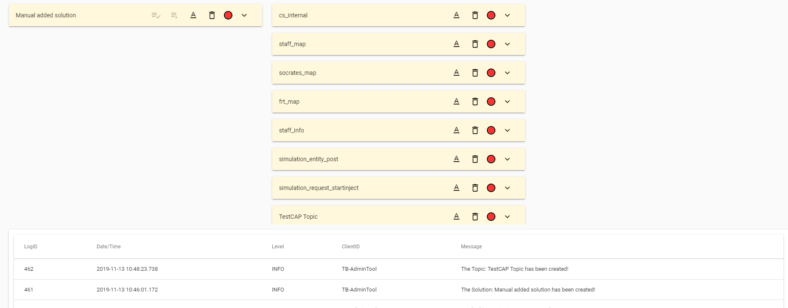
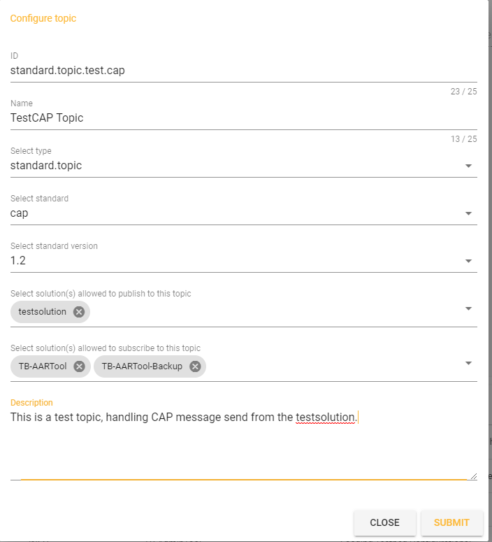

# Admin tool
Single Page Application to help you manage your personalized DRIVER+ test-bed and prepare the trial. It uses Apache Kafka as well as an Embedded Tomcat environment. The frontend is built with Vuejs.

# Introduction
The current version (v 1.2.29) of the Admin tool provides an overview of:
* the solutions connected to the Testbed, including their availability
* the available Kafka topics
* the gateways for message exchange

Furthermore, the Admin tool 
* creates the necessary topics, assigns schemas to topics and handles topic invitations.
* provides the possibility to initialize the testbed
* provides the possibility to start the trial once the testbed was initialized
* provides a section where log entries are displayed
* provides the possibility to create solutions/topics/gateways

# docker image
A docker image is on dockerhub available
* image: drivereu/test-bed-admin:latest

Following environment can be set:
* KAFKA_BROKER_URL --> string (e.g.: broker:9092)
* SCHEMA_REGISTRY_URL --> string(e.g.: http://schema_registry:3502)
* zookeeper_host --> string (e.g.: zookeeper)
* zookeeper_port --> int (e.g.: 3500)
* testbed_secure_mode --> 'DEVELOP', 'AUTHENTICATION' or 'AUTHENTICATION_AND_AUTHORIZATION'
* testbed_init_auto: 'false'
* reset_db: 'true'

And for AUTHENTICATION & AUTHORIZATION:
* management_ca_cert_path --> string (e.g.: http://localhost:9090)
* cert_handler_url --> string (e.g.: https://localhost:8443)
* cert_pem_handler_url --> string (e.g.: https://localhost:8443)
* security_rest_path_group --> string (e.g.: https://localhost:9443)
* security_rest_path_topic --> string (e.g.: https://localhost:9443)

# Swagger
For testing the Admin tool offers also a swagger interface.
This can be called by:
* http://<host:port>/swagger-ui.html

# Configuration
The configuration is located in the config folder. Using the default configuration the complete testbed is running on the local machine. Changes for e.g. Kafka connection have to be made in the consumer/producer properties file. Details about the possible
parameters can be found in the adapter description.

## Solution configuration
Every solution that is part of the testbed configuration has to be added to the solutions.json file. The Admin tool loads the
configuration on startup. As soon as a heartbeat (HB) message is received by the admin tool service, the solution will be marked as
available and up. HB is checked every 5 seconds. If no HB is received within 10 seconds the solution is marked as down.

## Topic configuration
All topics used for data exchanged have to be configured in the topics.json file. Each topic that is configured has to have an
unique topic name. The core topics (type=core.topic) should not be modified as the adapters assume they are available. Standard topics
(type=standard.topic) have to define
* which standard (by defining the msgType) 
* in which version (by defining the msgTypeVersion)

# Manual Configuration
The AdminTool offers also the possibility to add solutions/topics if they are missig in the configuration that is loaded on startup.

## Add Solution
For adding a Solution click on the "CONFIGURE NEW SOLUTION" item on top of the Solution list.
Fill in the data and cick "SUBMIT".

## Add Topic, assign the schema and define publisher/subscriber solutions 
For adding a Topic click on the "CONFIGURE NEW TOPIC" item on top of the Solution list.
Fill in the data, select the schema/version and the publisher/subscriber and cick "SUBMIT".

### possible msgTypes:
Corrently the AdminTool supports following msgTypes:
* cap
* largedata
* maplayer
* emsi
* mlp
* geojson
* geojson-sim
* geojson-photo
* named-geojson

## Gateway configuration
Gateways are more or less solutions in the testbed but they have additional configuration properties and therefor they are handled seperately. Like solutions gateways send heartbeat messages and are marked as up or down in the Admin tool.

## TTI Configurations
The TTI configuration can be created via json file that is loaded on admintool startup, or on the fly via the admintool gui. All
configurations that are available can be displayed by clicking the Configurations button in the top menu. 

For creating a new configuration, a click on the Create button opens the create configuration form.

## Organisations
For grantig the access to the TTI and to topics a known organisation needs be be available. By clicking on the Organisations button,
the list of current configured organisations is displayed.

Organistion can be edited and removed by clicking the corresponding icons.

For creating a new organisation, a click on the Create button opens the create organisation form.

## Schema File Upload
If you want to use your own created schema or any other that is not supported, you have the possibility to upload the schema file
so that you can register this to specific topics.

# Initialize the testbed
After calling the Admin tool, it displays all information configured for the trial
* All involved solutions
* All used topics
* All gateways

## Auto create mode
In the client.properties the parameter init.auto defines if the topic creation is done by invoking (either by clicking on the button, or invoking the Rest Endpoint by e.g.: Trial Manager), or if the Admin tool should create all core topics on startup automatically. Be aware, the Kafka has to be up and running before the Admin Service is started.

## reset DB mode
In the client.properties the parameter reset.db defines, if the DB tables should be cleaned during startup. If this is set to true, all tables (also the logs) are cleaned and the configuration defined in the json files is stored.

## Drow overview
To draw an overview picture how the solution are connected to the testbed and on which topics they are subscribe or are allowed to publish
messages, press the Overview button in the menu. The image is opened in a seperate tab and can also be downloaded

## Choose the active configuration
In the menu you can find a Configuration button. Pressing the button opens the menu with all availbable configurations. Selecting one will activate the configuration. Solutions, Topics and Gateways are automatically reloaded.

## Choose Testbed mode
The default Testbed mode is Develop. Meaning the testbed is open, everybody can connect and register for message and can also publish messages. Topics are created on the fly when they are needed. Switching to Authentication means that only those solutions can connect
that have a valid certificate to connect. Authentication and Authorization means, additionaly to connect via certificate also access to
topics is granted by the admin tool. Only solutions that are allowed to publish or subscribe can publish or subscribe.

## Create all topics
By pressing the "INITIALIZE TESTBED" button (right top in the header) the Admin tool creates all needed core topics and registers the corresponding schemas on them. The status of the topic creation can be seen in the log and by the indicator in the topic.

## Start the trial
The trial is started by the user clicking the "START TRIAL" button. When the trial is started, all standard topics are going to be created, the schemas are registered and the invite message is sent to all solutions that are allowed to connect to the topics (as publisher or subscriber).

## Solution availability
Each solution has an indication like the topics. As soon as the heartbeat from a solution is received the indication is set to green, indicating it is available.

## Log list
Each log entry that is received by the Admin tool is stored in the DB and is visible on the Admin HMI.

